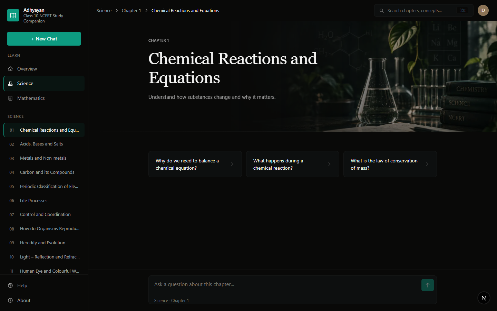
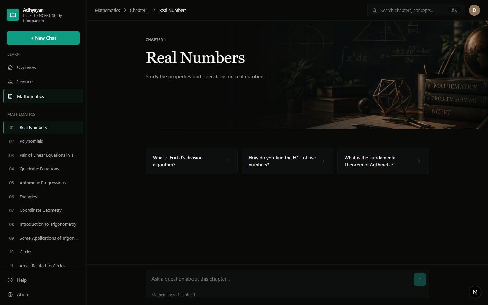
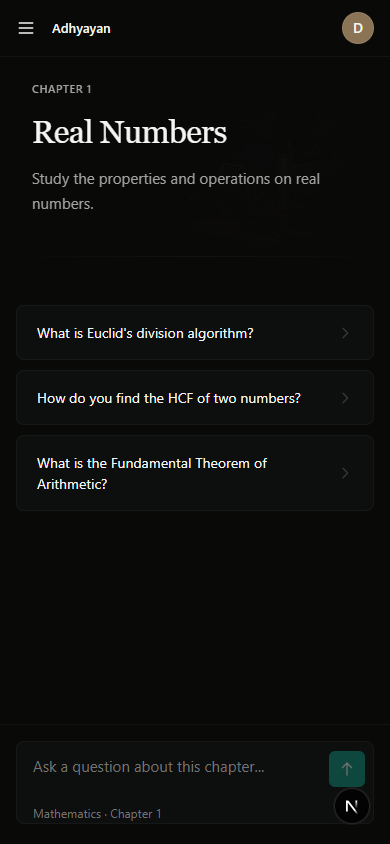
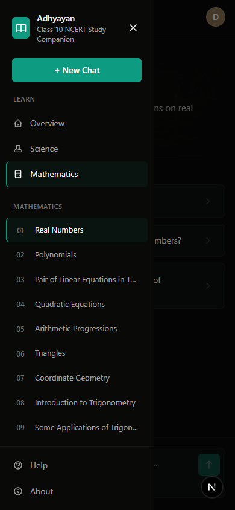

# Adhyayan

**Class 10 NCERT Study Companion**

Adhyayan is an AI-powered study companion for Class 10 NCERT Science and Mathematics. It provides chapter-focused conversations grounded in textbook material, helping students explore concepts through natural language questions.

> **Note:** This is an independent student project and is not affiliated with NCERT.

---

## What It Does

Students often need explanations that are easier to ask for than to search through a textbook. Adhyayan bridges this gap by letting students ask natural-language questions while keeping responses grounded in the official NCERT curriculum.

The system retrieves relevant textbook sections through semantic search, then generates contextual answers that cite their sources—helping students learn while maintaining transparency about where information comes from.

---

## Screenshots

### Adhyayan Home



### Mathematics



### Mobile



### Mobile Navigation



---

## How It Works

```
NCERT PDFs
    ↓
Text Extraction & Cleaning
    ↓
Section-Aware Chunking
    ↓
Embeddings (Sentence Transformers)
    ↓
FAISS Vector Index
    ↓
User Question → Semantic Retrieval
    ↓
Context Construction
    ↓
Gemini 2.5 Flash
    ↓
Grounded Answer + Sources
```

The system follows a Retrieval-Augmented Generation (RAG) architecture:

1. **Knowledge Base Creation**: NCERT textbooks are processed into searchable chunks with preserved section context
2. **Semantic Search**: Questions are converted to embeddings and matched against the knowledge base using FAISS
3. **Context Grounding**: Only retrieved NCERT content is supplied to the language model
4. **Answer Generation**: Gemini generates responses strictly based on the retrieved context
5. **Source Attribution**: Responses include chapter and section references

---

## Current Dataset

- **Class**: 10
- **Subjects**: Science, Mathematics  
- **Chapters**: 28 total (13 Science, 15 Mathematics)
- **Knowledge Chunks**: 785
- **Embedding Model**: all-MiniLM-L6-v2 (384 dimensions)

### Science Chapters

1. Chemical Reactions and Equations
2. Acids, Bases and Salts
3. Metals and Non-metals
4. Carbon and Its Compounds
5. Periodic Classification of Elements
6. Life Processes
7. How Do Organisms Reproduce?
8. Heredity and Evolution
9. Light: Reflection and Refraction
10. The Human Eye and the Colourful World
11. Electricity
12. Magnetic Effects of Electric Current
13. Our Environment

### Mathematics Chapters

1. Real Numbers
2. Polynomials
3. Pair of Linear Equations in Two Variables
4. Quadratic Equations
5. Arithmetic Progressions
6. Triangles
7. Coordinate Geometry
8. Introduction to Trigonometry
9. Some Applications of Trigonometry
10. Circles
11. Constructions
12. Areas Related to Circles
13. Surface Areas and Volumes
14. Statistics
15. Probability

---

## Key Features

### Learning Experience
- **Chapter-Focused Navigation**: Browse by subject and chapter
- **Suggested Questions**: Get started with curated questions for each chapter
- **Conversational Context**: Follow-up questions understand the conversation flow
- **Structured Answers**: Responses include Key Idea blocks, Examples, and formatted equations
- **Source Attribution**: Every answer cites the specific chapter and section used

### Technical Implementation
- **Subject Filtering**: Search within Science or Mathematics specifically
- **Semantic Retrieval**: Questions match meaning, not just keywords
- **FAISS Vector Search**: Fast similarity search over 785 knowledge chunks
- **Chemical Equation Rendering**: Proper subscript formatting (H₂O, CO₂)
- **Responsive Interface**: Works on desktop and mobile
- **Friendly Error Handling**: Clear messages when the API is unavailable

---

## Architecture

```
Next.js Frontend (Port 3000)
    ↓ HTTP
FastAPI Backend (Port 8000)
    ↓
scripts/rag_engine.py
    ↓
FAISS + Sentence Transformers + Gemini API
```

**Frontend** (Next.js 16.3.5)
- React 19 with TypeScript
- Server-side rendering
- Responsive design with Tailwind CSS 4
- Chapter navigation and chat interface

**Backend** (FastAPI)
- RESTful API with CORS support
- Health check endpoint
- Streaming response support

**RAG Engine** (Python)
- FAISS vector database
- Sentence Transformers for embeddings
- Google Gemini 2.5 Flash for generation
- Conversation history management

---

## Tech Stack

**AI & ML**
- Google Gemini 2.5 Flash
- Sentence Transformers (all-MiniLM-L6-v2)
- FAISS (vector search)

**Backend**
- Python 3.14
- FastAPI
- Uvicorn

**Frontend**
- Next.js 16.3.5
- React 19.2.8
- TypeScript 5
- Tailwind CSS 4

**Data Processing**
- PyMuPDF (text extraction)
- NumPy
- JSON

---

## Project Structure

```
Adhyayan/
├── api/
│   ├── __init__.py
│   └── main.py                 # FastAPI application
│
├── data/
│   ├── pdfs/
│   │   ├── science/            # NCERT Science PDFs
│   │   └── mathematics/        # NCERT Mathematics PDFs
│   ├── chunks/
│   │   ├── science_chunks.json
│   │   └── mathematics_chunks.json
│   ├── chunk_metadata.json     # All chunks with metadata
│   └── faiss_index.bin         # Vector database
│
├── design-reference/
│   ├── approved/
│   │   └── concept-c-approved.png
│   └── README.md
│
├── frontend/
│   ├── app/
│   │   ├── globals.css
│   │   ├── layout.tsx
│   │   └── page.tsx            # Main application
│   ├── components/
│   │   ├── AboutDialog.tsx
│   │   ├── ChapterHero.tsx
│   │   ├── HelpDialog.tsx
│   │   ├── MarkdownRenderer.tsx
│   │   ├── SearchDialog.tsx
│   │   ├── StructuredAnswer.tsx
│   │   └── UserAvatar.tsx
│   ├── lib/
│   │   ├── api/
│   │   │   ├── client.ts
│   │   │   ├── index.ts
│   │   │   └── types.ts
│   │   ├── curriculum-data.ts
│   │   └── hero-assets.ts
│   ├── public/
│   │   └── hero/               # Chapter hero images
│   ├── package.json
│   └── tsconfig.json
│
├── images/
│   ├── adhyayan-home.png
│   ├── adhyayan-mathematics.png
│   ├── adhyayan-mobile.png
│   └── adhyayan-mobile-menu.png
│
├── scripts/
│   ├── extract_text.py         # PDF → text
│   ├── clean_text.py           # Text normalization
│   ├── chunk_text.py           # Section-aware chunking
│   ├── generate_embeddings.py  # Create embeddings
│   ├── build_faiss_index.py    # Build vector index
│   ├── search_faiss.py         # Test retrieval
│   └── rag_engine.py           # Core RAG logic
│
├── API.md                      # API documentation
├── README.md
├── requirements.txt
├── start_api.py                # FastAPI starter
└── test_api.py                 # API tests
```

---

## Running Locally

### Prerequisites

- Python 3.10+
- Node.js 20+
- Google Gemini API key

### 1. Clone Repository

```bash
git clone https://github.com/deviantecho/ncert-rag-chatbot.git
cd ncert-rag-chatbot
```

### 2. Backend Setup

Create a Python virtual environment:

```bash
python -m venv venv
```

Activate it:

**Windows:**
```bash
venv\Scripts\activate
```

**Mac/Linux:**
```bash
source venv/bin/activate
```

Install dependencies:

```bash
pip install -r requirements.txt
```

Create a `.env` file in the root directory:

```env
GEMINI_API_KEY=your_api_key_here
```

Start the FastAPI backend:

```bash
python start_api.py
```

The API will be available at `http://127.0.0.1:8000`

Test the health endpoint:

```bash
curl http://127.0.0.1:8000/api/health
```

### 3. Frontend Setup

Navigate to the frontend directory:

```bash
cd frontend
```

Install dependencies:

```bash
npm install
```

Create `frontend/.env.local`:

```env
NEXT_PUBLIC_API_URL=http://127.0.0.1:8000
```

Start the development server:

```bash
npm run dev
```

The app will be available at `http://localhost:3000`

### 4. Production Build

Build the frontend for production:

```bash
cd frontend
npm run build
npm run start
```

---

## API

See [API.md](API.md) for detailed API documentation.

**Endpoints:**

- `GET /api/health` - Health check
- `POST /api/chat` - Submit a question

**Example Request:**

```bash
curl -X POST http://127.0.0.1:8000/api/chat \
  -H "Content-Type: application/json" \
  -d '{
    "message": "What is a balanced chemical equation?",
    "chat_history": [],
    "subject_filter": "Science",
    "stream": false
  }'
```

---

## Future Work

The next phase will focus on **RAG evaluation and improvement**:

### Planned Experiments
- **Retrieval Strategy Comparison**: Dense vs. sparse vs. hybrid search
- **Reranking**: Cross-encoder models to improve context selection
- **Query Rewriting Evaluation**: Measure impact on retrieval quality
- **Retrieval Metrics**: Recall@K, MRR, NDCG
- **Answer Faithfulness**: LLM-as-judge evaluation
- **Latency/Cost Analysis**: Performance vs. accuracy tradeoffs
- **Evaluation Dashboard**: Visualize metrics and compare strategies

### Additional Improvements
- Expand to other NCERT classes (9, 11, 12)
- Add more subjects (Social Science, English)
- Citation highlighting in answers
- PDF source linking
- User authentication
- Analytics dashboard

---

## About

**Built by Devesh Kumar Singh** ([@deviantecho](https://github.com/deviantecho))  
Computer Science & Engineering, Shiv Nadar University

This project demonstrates practical implementation of:
- Retrieval-Augmented Generation (RAG)
- Semantic search and vector databases
- Embedding models and information retrieval
- Full-stack AI application development
- API design and frontend integration

### Connect

- GitHub: [github.com/deviantecho](https://github.com/deviantecho)
- X: [x.com/deviantecho](https://x.com/deviantecho)
- LinkedIn: [linkedin.com/in/deviantecho](https://www.linkedin.com/in/deviantecho)
- Email: devesh.singhx22@gmail.com

---

## Disclaimer

Adhyayan is an independent student project and is not affiliated with NCERT (National Council of Educational Research and Training).

---

## License

This project is for educational purposes.
